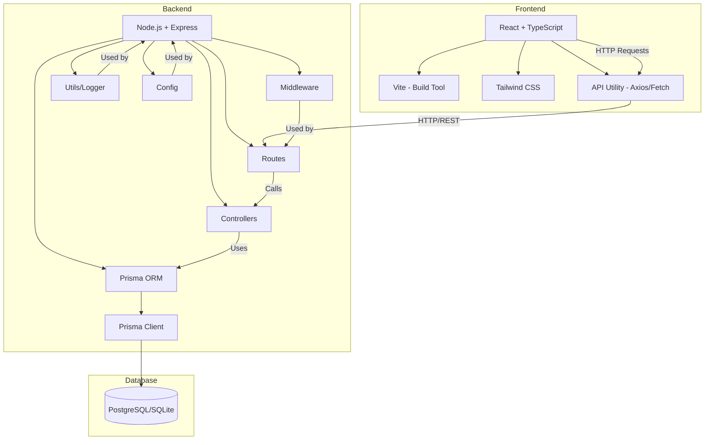
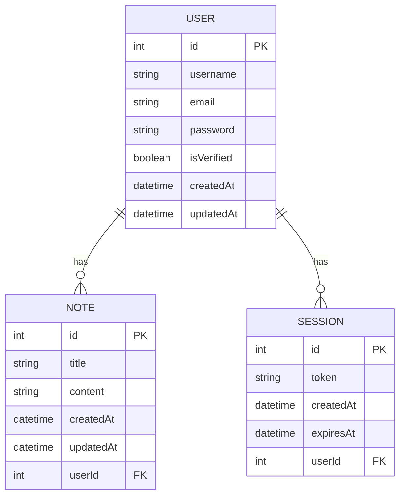
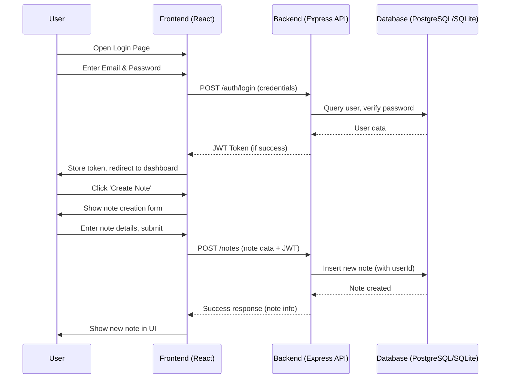
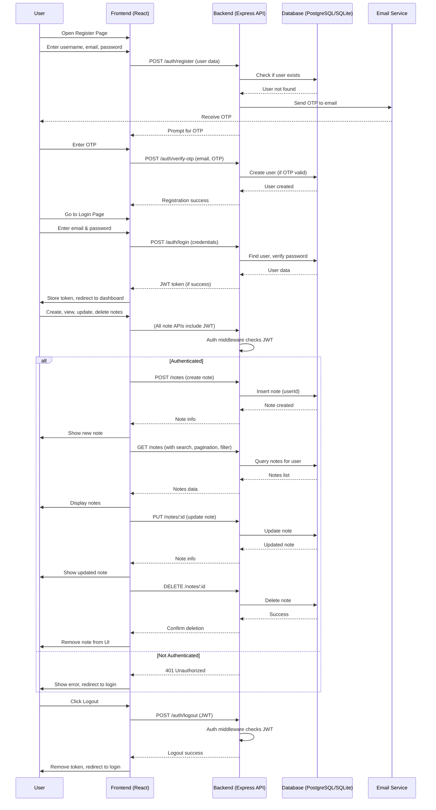

# Full Stack Associate Software Engineer Interview Q&A

This document contains interview questions and answers based on the provided notes-app project codebase during my interview. The questions cover backend, frontend, database, architecture, and general software engineering concepts relevant to the position.

---

## 1. **Project Overview and Architecture**

**Q:** **Can you briefly describe the architecture and main features of your notes-app project?**

**A:**
The notes-app is a full-stack application with a TypeScript/Node.js backend and a React/TypeScript frontend. The backend uses Express.js, Prisma ORM for database access, and includes authentication, note management, and logging. The frontend is built with Vite, React, and Tailwind CSS, providing a modern, responsive UI. Key features include user registration/login with OTP verification, CRUD operations for notes, pagination, search, and user profile management.

**Q:** **Can you explain the architecture of your project?**

**A:**
The project follows a modular, layered architecture:

- The backend is organized by responsibility (controllers, models, middleware, routes, utils, config) and uses Prisma for ORM.
- The frontend is organized by feature (components, pages, layouts, hooks, utils, assets).
- The backend exposes a REST API, and the frontend consumes it via HTTP requests.
- Environment variables and configuration files separate concerns and enable scalability.

**Q:** **What is the purpose of each file and folder in your project? Can you explain what `.env` does in both frontend and backend?**

**A:**

- `.env`: Stores environment variables such as API keys, database URLs, and secrets. In the backend, it configures sensitive data (e.g., JWT secret, database connection string). In the frontend, it can store public environment variables (e.g., API base URL) prefixed with `VITE_` for Vite to expose them to the client.
- `backend/` and `frontend/`: Contain the server and client code, respectively.
- `backend/src/controllers/`: Business logic for authentication and notes.
- `backend/src/models/`: Prisma models for users, notes, and sessions.
- `backend/src/middleware/`: Express middleware for authentication, error handling, and logging.
- `backend/src/routes/`: API endpoint definitions.
- `backend/src/utils/`: Helper functions and logger setup.
- `backend/src/config/`: Configuration files for database, email, and Swagger docs.
- `backend/prisma/`: Prisma schema and migrations.
- `backend/logs/`: Stores application logs.
- `frontend/src/components/`: Reusable UI components.
- `frontend/src/pages/`: Main application pages.
- `frontend/src/layouts/`: Layout components.
- `frontend/src/hooks/`: Custom React hooks.
- `frontend/src/utils/`: Helper functions and API utilities.
- `frontend/src/assets/`: Images and SVGs.
- `frontend/public/`: Static assets served directly.
- `README.md`: Project documentation.
- `package.json`: Project dependencies and scripts.
- `tsconfig.json`: TypeScript configuration.
- `vite.config.ts`: Vite build configuration.
- `tailwind.config.js`: Tailwind CSS configuration.
- `postcss.config.js`: PostCSS configuration for Tailwind.

---

## 2. **Backend: Node.js, Express, and Prisma**

**Q:** **How is the backend structured, and what are the main responsibilities of each folder?**

**A:**

- `controllers/`: Handle business logic for authentication and notes.
- `models/`: Define Prisma models for users, notes, and sessions.
- `middleware/`: Custom Express middleware for authentication, error handling, and logging.
- `routes/`: Define API endpoints for authentication and notes.
- `utils/`: Helper functions and logger setup.
- `config/`: Configuration for database, email, and Swagger docs.

**Q:** **How does authentication work in your backend?**

**A:**
Authentication uses JWT tokens and OTP verification. On registration, a user receives an OTP via email. After verifying the OTP, they can log in and receive a JWT for protected routes. Middleware checks the JWT for protected endpoints.

**Q:** **How is error handling implemented?**

**A:**
A centralized error handler middleware (`errorHandler.ts`) catches errors from routes and controllers, formats them, and sends appropriate HTTP responses. Custom error classes can be used for more granular control.

**Q:** **How do you manage database migrations and models?**

**A:**
Prisma is used for schema definition and migrations. The `prisma/schema.prisma` file defines models, and migrations are managed via the `prisma/migrations/` folder. Prisma Client is used for type-safe database access in the code.

**Q:** **Why did you choose Node.js and Express for the backend, and why not another backend framework or language? Why not NestJS?**

**A:**
Node.js is well-suited for building scalable, high-performance web applications due to its non-blocking, event-driven architecture. Express is a minimal and flexible Node.js web framework that simplifies routing, middleware, and server setup. Compared to alternatives like Django (Python) or Spring Boot (Java), Node.js with Express offers faster development cycles, a large ecosystem, and seamless integration with JavaScript/TypeScript on both frontend and backend, which is ideal for full-stack projects. NestJS is a great framework for building scalable server-side applications, but it introduces more abstraction and boilerplate, which can be overkill for a small-to-medium project like this. Express provides more direct control and a gentler learning curve for rapid prototyping.

**Q:** **Why did you use Prisma as the ORM, and not another ORM like Sequelize or TypeORM?**

**A:**
Prisma provides a type-safe, auto-generated client, making database queries safer and easier to maintain in TypeScript projects. Its schema-based approach and migration system are straightforward and developer-friendly. Compared to Sequelize or TypeORM, Prisma offers better TypeScript support, improved performance, and a more modern developer experience.

**Q:** **Why did you use JWT for authentication, and not sessions or OAuth?**

**A:**
JWT (JSON Web Tokens) are stateless, scalable, and easy to use for REST APIs. They allow secure transmission of claims between parties and are well-supported in the Node.js ecosystem. Sessions require server-side storage, which can be less scalable. OAuth is more complex and typically used for third-party authentication, which was not required for this project.

**Q:** **Why is a logger used in your platform? What is the difference between `console.log` and a logger? How did you implement it?**

**A:**
A logger provides structured, timestamped, and level-based logging (info, error, warn, etc.), which is essential for debugging, monitoring, and production diagnostics. Unlike `console.log`, a logger can write to files, rotate logs, and be configured for different environments. In my project, I implemented a custom logger in `backend/src/utils/logger.ts` that writes logs to `logs/app.log` and is used throughout the backend for consistent logging.

---

## 3. **Database and ORM**

**Q:** **What database is used, and how is it integrated?**

**A:**
The project uses a relational database (e.g., PostgreSQL or SQLite) managed via Prisma ORM. The schema is defined in `schema.prisma`, and Prisma Client is used for database operations in the backend.

**Q:** **How do you handle migrations and seeding?**

**A:**
Migrations are created and applied using Prisma CLI commands. Seeding scripts can be added to populate the database with initial data if needed.

**Q:** **Why did you choose a relational database (PostgreSQL/SQLite) and not a NoSQL database like MongoDB or a different SQL database like MySQL?**

**A:**
Relational databases are well-suited for structured data with clear relationships, such as users and notes. They provide strong consistency, support for complex queries, and transactional integrity. Prisma works seamlessly with relational databases like PostgreSQL and SQLite. MySQL is also a good option, but PostgreSQL offers more advanced features and better standards compliance. NoSQL databases like MongoDB are better for unstructured or rapidly changing data, which was not the case for this project. The relational model fits the application's requirements best.

**Q:** **How did you design the database?**

**A:**
I used Prisma's schema definition to model users, notes, and sessions with clear relationships. The schema is normalized to avoid redundancy and ensure data integrity. Migrations are managed with Prisma CLI, and the design supports scalability and future features.

Here is a Mermaid ER diagram representing the database schema:

- **USER**: Stores user information (username, email, password, verification status, timestamps).
- **NOTE**: Stores notes with a foreign key to the user, and timestamps.
- **SESSION**: Stores session tokens for authentication, linked to the user.

This structure ensures normalized relationships and supports future extensibility (e.g., adding tags, shared notes, etc.).

---

**Q:** **Why did you choose the specific technologies and libraries for this project?**

**A:**
The technology choices for both frontend and backend were made to balance developer productivity, scalability, maintainability, and user experience. Here’s why each major technology was selected:

### Frontend
- **React**: Chosen for its component-based architecture, large ecosystem, and flexibility. React makes it easy to build reusable UI components and manage state efficiently.
- **Vite**: Selected for its fast development server, instant hot module replacement, and modern build features. Vite is much faster than older tools like Webpack or Create React App.
- **TypeScript**: Used for static typing, which helps catch errors early and improves code maintainability and developer confidence.
- **TailwindCSS**: Adopted for utility-first styling, rapid prototyping, and consistent design. It reduces the need for custom CSS and speeds up UI development.
- **React Router**: Enables client-side routing for a seamless single-page application experience.
- **Axios**: Used for making HTTP requests to the backend API, with a simple and promise-based API.
- **React Hook Form & Yup**: Provide robust form validation and management, improving user experience and reducing bugs in form handling.
- **React Icons & React Toastify**: Enhance UI with icons and user feedback via toast notifications.
- **Chart.js & ReCharts**: Chosen for data visualization, allowing users to see trends and analytics in their notes.
- **Moment.js**: Used for date and time formatting, making timestamps user-friendly.
- **Dotenv**: Manages environment variables securely, keeping sensitive data out of the codebase.

### Backend
- **Node.js**: Selected for its non-blocking, event-driven architecture, which is ideal for scalable web applications. It also allows for full-stack JavaScript development.
- **Express**: Chosen for its minimalism, flexibility, and ease of use in building REST APIs.
- **PostgreSQL**: Used as the database for its reliability, advanced features, and strong support for relational data and complex queries.
- **Prisma ORM**: Provides type-safe database access, easy migrations, and a modern developer experience compared to alternatives like Sequelize or TypeORM.
- **Nodemon**: Enables automatic server restarts during development, improving productivity.
- **Cors**: Handles cross-origin requests, allowing the frontend and backend to communicate securely.
- **Bcrypt**: Used for secure password hashing, protecting user credentials.
- **JWT & jsonwebtoken**: Implement stateless authentication, making the API scalable and secure.
- **Nodemailer & crypto**: Used for sending emails (e.g., OTP verification) and generating secure tokens.
- **Speakeasy**: Filters profane content, ensuring notes remain appropriate.
- **Cookie-parser**: Parses cookies for session management and authentication.
- **pg**: PostgreSQL client for direct database access when needed.
- **Winston**: Implements structured logging for monitoring and debugging, with log files stored in the backend.
- **Swagger**: Provides interactive API documentation, making it easier for developers to understand and test endpoints.
- **Dotenv**: Manages environment variables for secure configuration.

### Why Not Alternatives?
- **React vs. Angular/Vue**: React was chosen for its flexibility and popularity. Angular is more opinionated and heavier, while Vue has a smaller enterprise adoption.
- **Vite vs. Webpack/Create React App**: Vite offers faster builds and a better developer experience.
- **PostgreSQL vs. MongoDB/MySQL**: PostgreSQL supports complex queries and relational data, which fits the app’s requirements better than NoSQL or simpler SQL databases.
- **Prisma vs. Sequelize/TypeORM**: Prisma’s type safety and migration system are more modern and developer-friendly.
- **JWT vs. Sessions/OAuth**: JWTs are stateless and scalable, while sessions require server-side storage. OAuth is more complex and suited for third-party authentication.
- **TailwindCSS vs. CSS Modules/Styled-components**: Tailwind speeds up development and ensures design consistency.

These choices ensure the app is robust, maintainable, and scalable, while also providing a great developer and user experience.
---

## 4. **Frontend: React, Vite, and Tailwind CSS**

**Q:** **How is the frontend structured?**

**A:**

- `components/`: Reusable UI components (e.g., modals, cards, loaders).
- `pages/`: Main pages (Home, Login, Register, UserProfile, etc.).
- `layouts/`: Layout components like Header and Navbar.
- `hooks/`: Custom React hooks (e.g., form validation).
- `utils/`: Helper functions and API utilities.
- `assets/`: Images and SVGs.

**Q:** How does the frontend communicate with the backend?

**A:**
The frontend uses a utility (`utils/api.ts`) to make HTTP requests to the backend API endpoints for authentication, note management, and user profile actions. Axios or fetch is used for these requests.

**Q:** How is form validation handled?

**A:**
Form validation is managed using custom hooks (`useFormValidation.ts`) and validation schemas (`utils/validationSchemas.ts`), ensuring user input is validated before submission.

**Q:** How is state managed in your React frontend?

**A:**
State is managed using React's built-in hooks (`useState`, `useEffect`). For local component state, `useState` is used. For side effects and data fetching, `useEffect` is used. If the application grows, Context API or state management libraries like Redux or Zustand can be introduced for global state.

**Q:** Why did you choose React for the frontend, and not Angular or Vue?

**A:**
React is a popular, component-based library with a large community, excellent documentation, and a rich ecosystem. It offers flexibility and is easy to integrate with TypeScript and modern build tools like Vite. Angular is more opinionated and heavier, while Vue is also a good choice but has a smaller enterprise adoption compared to React.

**Q:** Why did you use Vite as the build tool, and not Create React App or Webpack?

**A:**
Vite provides faster development startup and hot module replacement due to its use of native ES modules. It is more modern and lightweight compared to Create React App or Webpack, which can be slower and more complex to configure.

**Q:** Why did you use Tailwind CSS for styling, and not CSS modules or styled-components?

**A:**
Tailwind CSS offers utility-first classes that speed up development and ensure design consistency. It reduces the need to write custom CSS and is easy to integrate with React. CSS modules and styled-components are also good options, but Tailwind is more efficient for rapid prototyping and maintaining a consistent design system. It also has a large community and ecosystem.

**Q:** How do you ensure responsiveness across all devices?

**A:**
I use Tailwind CSS's built-in responsive utilities (e.g., `sm:`, `md:`, `lg:`, `xl:`) to apply styles at different breakpoints. For more granular control, I extend breakpoints in `tailwind.config.js` (e.g., `xs:`, `2xl:`). I also use browser extensions like Responsive Viewer to test layouts on various devices and orientations.

---

## 5. **API and Documentation**

**Q:** What have you used for API documentation? Differentiate Postman and Swagger.

**A:**
I used Swagger (OpenAPI) for API documentation, configured in `backend/src/config/swagger.ts`. Swagger provides interactive, always-up-to-date documentation directly from code annotations. Postman is primarily for manual API testing and sharing collections, while Swagger is for automated, self-hosted documentation and contract-first development.

**Q:** What is the difference between REST API and other API styles (e.g., GraphQL, gRPC)?

**A:**
REST APIs use standard HTTP methods and resources, are stateless, and are easy to cache and scale. GraphQL allows clients to specify exactly what data they need, reducing over-fetching, but adds complexity. gRPC is a high-performance, contract-based protocol using Protobuf, suitable for internal microservices. REST is best for simple, resource-based APIs.

---

## 6. **Security**

**Q:** What security measures are implemented?

**A:**

- Passwords are hashed before storage.
- JWT tokens are used for authentication.
- OTP verification for registration.
- Input validation and error handling to prevent common vulnerabilities.
- CORS configuration and secure HTTP headers can be added for production.

---

## 7. **Testing and Logging**

**Q:** Are there any tests implemented?

**A:**
The current codebase does not show explicit test files, but tests can be added using Jest or similar frameworks for both backend and frontend.

---

## 8. **Frontend/Backend Data Handling and Storage**

**Q:** What is the difference between localStorage and cookies?

**A:**
localStorage stores data in the browser with no expiration, accessible via JavaScript, and is not sent with every HTTP request. Cookies can have expiration, are sent with HTTP requests, and can be marked as HttpOnly for security. Use localStorage for client-only data, cookies for authentication/session data.

**Q:** What is the difference between backend filtering and frontend filtering, and when should each be used?

**A:**
Backend filtering processes data on the server before sending it to the client, reducing bandwidth and improving performance for large datasets. Frontend filtering is done in the browser, suitable for small datasets already loaded. Use backend filtering for scalability and security, frontend filtering for simple, small data.

---

## 9. **General Software Engineering and Teamwork**

**Q:** How do you ensure code quality and maintainability?

**A:**

- Use of TypeScript for type safety.
- Modular folder structure.
- Linting and formatting (ESLint, Prettier).
- Clear separation of concerns.
- Documentation in README files.

**Q:** How do you handle errors and edge cases?

**A:**

- Centralized error handling middleware.
- Input validation on both frontend and backend.
- Graceful handling of failed API requests and user feedback.

**Q:** How do you approach learning new technologies or frameworks?

**A:**
I start by reading official documentation, building small prototypes, and integrating new tools incrementally into projects. I also seek feedback from peers and stay updated with community best practices.

**Q:** How do you handle feedback and code reviews?

**A:**
I view feedback as an opportunity to learn and improve. I actively participate in code reviews, both giving and receiving constructive feedback, and strive to write clean, understandable code.

**Q:** What distinguishes you from other frontend developers in the market?

**A:**
During my previous work as a Frontend Developer, I focused on accessibility, ensuring that websites were usable by visually impaired users through semantic HTML, ARIA attributes, and keyboard navigation. I also explored design patterns and principles, worked with Figma, and led UI projects from design to development, bridging the gap between design and engineering.

---

## 10. **Future Enhancements**

**Q:** What are your plans for future enhancements?

**A:**

- Add automated testing (unit, integration, E2E)
- Implement role-based access control
- Add user settings and profile picture upload
- Improve error messages and user feedback
- Optimize performance and accessibility
- Add internationalization (i18n)
- Enhance API documentation

---

## 11. **DSA (Data Structures & Algorithms) Questions Relevant to Notes-App**

**Q1:** How would you efficiently implement a search feature to find notes by keyword in a large dataset?

**A:**
To efficiently search notes by keyword, leverage full-text search capabilities provided by your database (e.g., PostgreSQL's `tsvector` and `tsquery`). Create a full-text index on the note content and title fields. When a user searches, use a SQL query with the `@@` operator to match keywords. This allows for fast, ranked, and relevant search results even with millions of notes. For smaller datasets or in-memory search, you could use a hash map or trie to map keywords to note IDs, but for scalability, always use the database's indexing and pagination features.

---

**Q2:** How would you design a feature to show the most recently accessed notes for a user?

**A:**
Track each note's last access time by updating a `lastAccessed` timestamp column in the database every time a user views or edits a note. To retrieve the most recent notes, query the notes table for the user and order by `lastAccessed DESC` with a limit. This approach is efficient (O(log n) for index updates, O(k) for retrieval) and scalable. If you needed to cache this in memory (e.g., for a dashboard), you could use an LRU (Least Recently Used) cache implemented as a doubly linked list with a hash map for O(1) access and update.

---

**Q3:** If you had to implement a tag system for notes (where each note can have multiple tags), what data structure would you use and why?

**A:**
Use a many-to-many relationship in the database, typically implemented with a join table (e.g., `NoteTag` with `noteId` and `tagId`). This allows efficient queries in both directions: find all notes with a given tag, or all tags for a note. In application code, you can use a `Map<noteId, Set<tagId>>` and `Map<tagId, Set<noteId>>` for fast lookups. This structure supports efficient addition, removal, and querying of tags and notes.

---

**Q4:** How would you prevent duplicate notes (same title and content) from being created efficiently?

**A:**
Before inserting a new note, compute a hash (e.g., SHA-256) of the concatenated title and content. Store this hash in the database with a unique constraint. On note creation, check if the hash already exists by querying the database. This ensures O(1) duplicate detection at the database level and prevents race conditions. This approach is scalable and avoids expensive full-table scans.

---

**Q5 (Unanswered):** Suppose you want to implement a "shared notes" feature, where a note can be shared with multiple users, and each user can have different permissions (read, write, comment). How would you design the data model and efficiently check permissions for a given user and note? What are the trade-offs and how would you scale this for millions of users and notes?

**A:**

- **Data Model:**
  - Create a `SharedNote` join table with columns: `noteId`, `userId`, and `permission` (enum: read, write, comment).
  - Add indexes on (`noteId`, `userId`) and (`userId`, `noteId`) for fast lookups.
  - Optionally, use a composite primary key (`noteId`, `userId`).
- **Permission Check:**
  - To check if a user has permission for a note, query `SELECT permission FROM SharedNote WHERE noteId = ? AND userId = ?`.
  - This is O(1) with proper indexing.
- **Trade-offs:**
  - **Pros:**
    - Flexible: supports arbitrary permissions and easy to extend.
    - Scalable: with proper indexing, lookups remain fast even with millions of rows.
  - **Cons:**
    - Table can grow large; may need partitioning or sharding for very large scale.
    - Write-heavy workloads (e.g., sharing/unsharing many notes at once) may require batching or background jobs.
- **Scaling:**
  - Use database sharding by user or note if the table grows too large for a single instance.
  - Use caching (e.g., Redis) for frequently checked permissions.
  - For auditability, add a `sharedAt` timestamp and track changes in a log table.
- **Advanced:**
  - For even more complex permissions (e.g., group sharing, inheritance), consider an ACL (Access Control List) pattern or a graph database.
  - Use background jobs to clean up stale shares or recalculate permissions if needed.

This design ensures permission checks are fast, flexible, and scalable, and is suitable for real-world collaborative applications like Google Docs or Notion.

---

**Q:** Can you explain the user flow from login to note creation in your system?

**A:**
Here is a high-level user flow architecture for the process from login to note creation, represented using a Mermaid diagram:

- The user logs in via the frontend, which sends credentials to the backend.
- The backend authenticates the user, returns a JWT, and the frontend stores it.
- When the user creates a note, the frontend sends the note data and JWT to the backend.
- The backend verifies the JWT, creates the note in the database, and returns the result to the frontend for display.

---

**Q:** Can you explain the complete user flow in your system, from registration to note management?

**A:**
Below is a detailed user flow architecture for your notes-app, covering registration (with OTP), login, authentication, note CRUD, and logout, as implemented in your codebase:

- Registration requires OTP verification via email before account creation.
- All note operations require a valid JWT, checked by backend middleware.
- Notes can be created, read (with search, pagination, filter), updated, and deleted.
- Logout clears the session/token on the frontend.
- Unauthorized actions are blocked and prompt user feedback.

---

**Q:** What are your future plans after joining Leapfrog?

**A:**
After joining Leapfrog, my primary goal is to grow as a well-rounded full stack engineer. While I am confident in my frontend skills, I plan to:

- Deepen my understanding of backend development, including Node.js, Express, and advanced API design.
- Explore and practice more with SQL and other database technologies (e.g., PostgreSQL, MySQL, MongoDB), and learn to write optimized queries.
- Study and contribute to legacy systems like the HRIS Vyaguta to understand how large-scale, real-world codebases are structured and maintained.
- Collaborate closely with team members and fellow developers, actively participating in code reviews to improve code quality and learn best practices.
- Focus on writing clean, maintainable, and optimized code, and adopt industry standards for documentation and testing.
- Explore DevOps practices, including CI/CD pipelines, containerization (Docker), and cloud platforms like AWS, to understand the full software delivery lifecycle.
- Learn more about system design, architecture patterns, and scalable solutions.
- Improve my communication and collaboration skills, especially as I tend to be introverted and want to become more comfortable sharing ideas and asking questions.
- Get involved in design discussions and learn more about UI/UX principles, possibly working with designers to bridge the gap between design and development.
- Take initiative in knowledge sharing, mentoring, and contributing to team learning sessions.
- Stay updated with new technologies and frameworks, and be proactive in adopting tools that improve productivity and code quality.

Overall, I want to become a valuable team member who not only delivers features but also contributes to the team's growth, codebase health, and company culture.

---

_End of Interview Q&A_
